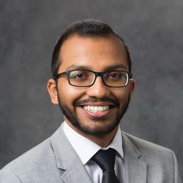

## About Me

Hi! My name is Pradip Krishnaa Murugan. I was born in India, raised in UAE, and educated in USA and Germany. I love experiencing new cultures and traveling so much that learning languages is one of my biggest passions.  
I am fluent in English, Tamil, and Kannada with moderate-to-begineer knowledge in German, French, and Arabic.  

I am a Master's student in **Mechanical Engineering** at Purdue University. I currently do research at the Fluid Dynamics Lab on a renewable energy system as a product development engineer. I have a Bachelor's degree in Mechanical Engineering and minors in Business Economics and Global Engineering Studies from Purdue. Needless to say, I'm a Boilermaker through and through! 

I have always been passionate about product design and development. I have been fortunate to gain valuable industrial and research experience from Textron, Leibniz University, Audi, and Rane in USA, Germany, UAE, and India. 

**Let's chat!** Please reach out to me via [Email](mailto:pmurugan@purdue.edu) or [LinkedIn](https://www.linkedin.com/in/pradipkrishnaa)

## Research Interest

I currently work on mechanical product design and development of a modular river current energy converter to harness power from low velocity river flow in local rivers. I innovate, test, and implement novel designs to meet and surpass industry standards in efficiency, structural integrity, and mechanical performance. My work is mainly performed using Siemens NX, SolidWorks, NX Nastran, and MATLAB. 

## Education

Purdue University  
Master of Science in Mechanical Engineering

Purdue University  
Bachelor of Science in Mechanical Engineering
Minors: Business Economics, Global Engineering Studies

Leibniz University Hannover  
Exchange Student in the Department of Mechanical Engineering

## Work Experience

**Graduate Research Assistant** at Purdue University  
*June 2020 - Present*

**Research Assistant** at Leibniz University Hannover  
*April 2019 - August 2019*

**Product Development** Intern at Textron  
*January 2019 - March 2019*

**Manufacturing Intern** at Rane Automobiles   
*June 2018 - August 2018*

**Aftersales Intern** at Audi AG  
*June 2017 - August 2017*

## Projects

Autonomous Lane Following Robot  
*2019*

## References

1. Dr. Jun Chen - Purdue University <junchen@purdue.edu>
2. Dr. Greg Jensen - Purdue University <jensen23@purdue.edu>
3. Joe Tort - Purdue University <jtort@purdue.edu>
  
    